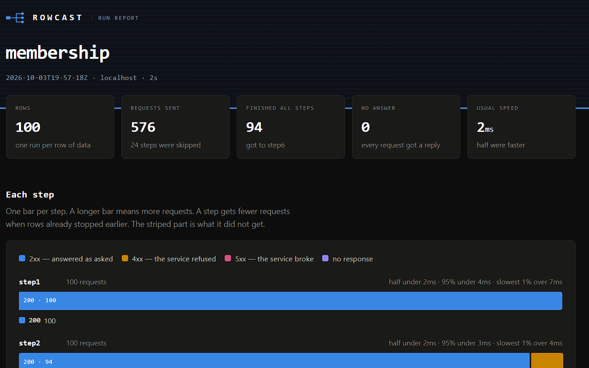
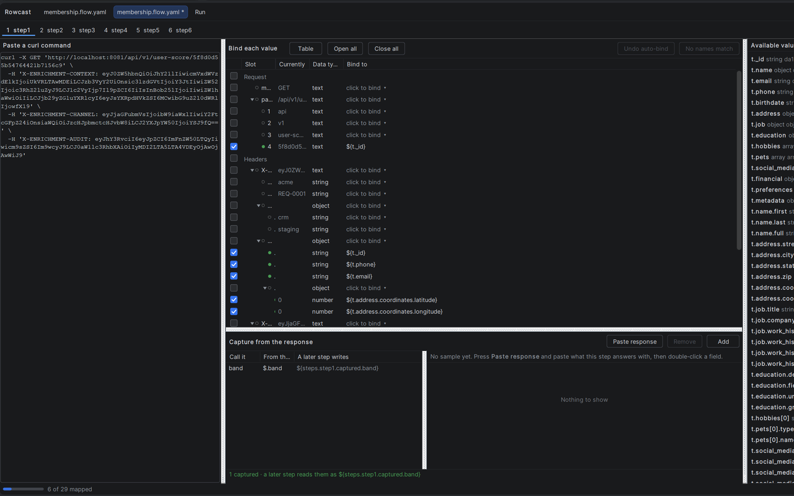
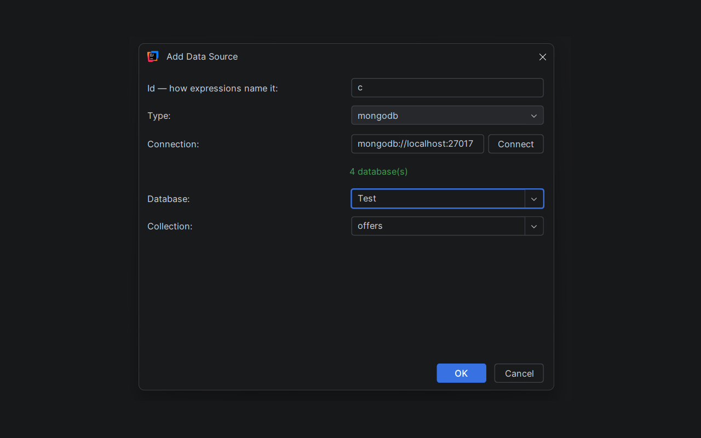
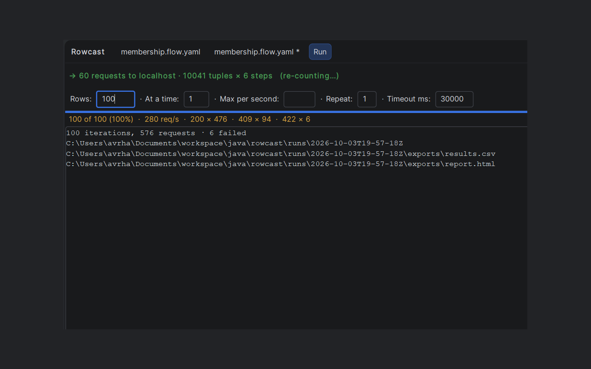
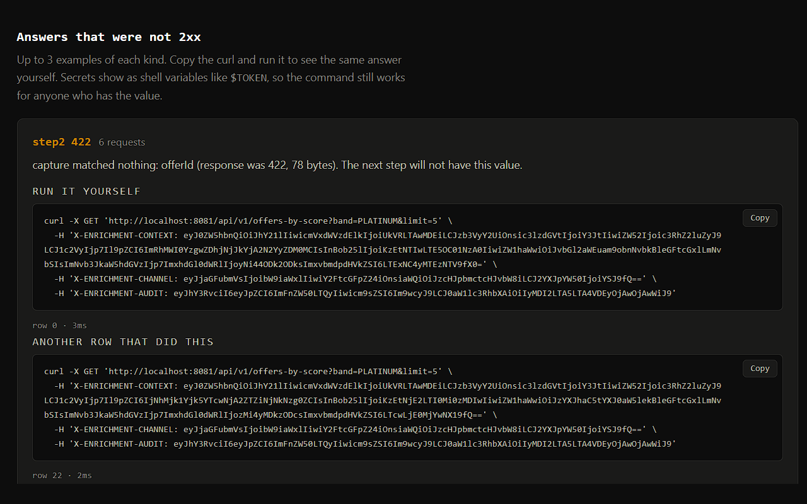
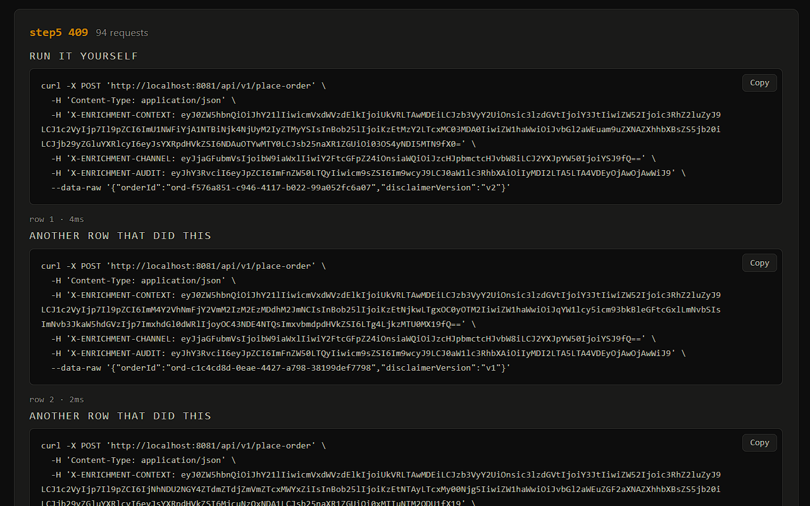

  

# Rowcast

**Run an API call once for every row of real data, and see what actually came back.**

Rowcast is a plugin for JetBrains IDEs. It takes rows from your data and a curl command. It
turns them into many real requests and records every response, with a curl you can replay for
each one.

This repository is the public home of the plugin: the license, the screenshots, and the place
to report bugs. The source code is private.

## What it does

- **Real data in.** Read rows from JSONL files, MongoDB, or SQL databases over JDBC
  (SQL Server, DB2, SQLite). Join sources on a shared field.
- **Map fields to the request.** Bind a column to any part of the curl: path, query, header,
  or body, including JSON inside a Base64 header.
- **Whole flows, not single calls.** Chain steps. A value one step returns, like an id, feeds
  the next step's request.
- **See the results.** An HTML report with status counts per step, response times, and example
  failures with a curl you can copy and run.
- **Check a flow before you run it.** The audit finds values you pasted with a curl but never
  bound, like a fixed id that should come from your data.

## Install

In your IDE: **Settings → Plugins → Marketplace**, search for **Rowcast**, and click
**Install**.

Works in IntelliJ IDEA 2023.3 and later, and in other JetBrains IDEs of the same version
(WebStorm, PyCharm, DataGrip, and more). Both Community and Ultimate.

## Getting started

1. Open the **Rowcast** tool window.
2. Add a data source.
3. Paste a curl, and bind fields from your data to the request.
4. Preview a few rows, then run.
5. Open the report.

## Screenshots

| | |
|---|---|
|  |  |
| Bind fields from your data to any part of a curl. | Add a data source: JSONL, MongoDB, or JDBC. |
|  |  |
| Run, and watch the status counts live. | The report: what each step got back. |
|  |  |
| Every failure comes with a curl you can run yourself. | A few examples of each kind of answer. |

## Your data stays with you

Rowcast runs on your computer. It reads the data sources you set up and sends requests only to
the addresses you set up. It sends nothing to us: no data, no requests, no usage statistics.

Passwords are kept in your IDE's password store. Rowcast never writes them to its files.

## DB2

Rowcast does not include IBM's DB2 driver, because its license does not allow that. Download
the driver (`jcc` JAR) from IBM and point the JDBC source at it. The SQL Server driver is
included.

## Report a bug or ask a question

Open an issue: <https://github.com/avrhamo/rowcast-plugin/issues>

Please include your IDE version, the Rowcast version, and what you expected to happen.
Remove passwords and private data from anything you paste.

Email: avrhamo@gmail.com

## License

Rowcast is free to use. It is not open source. See [LICENSE](LICENSE).
